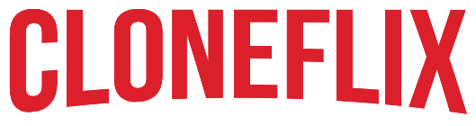

<h1 align="center">
  
  <p>Trailer catalog 📕🎦</p>

</h1>


# **🎨 Layout**
🚧 Work in progress
<h2 align="center"><a href="https://netflix-clone-app.vercel.app/">Access Here</a></h2>


# 🧾 About


Trailer catalog, made in React and using other cool tools.

# 🧰 Tools

## 📚 APIs
- [TMDB API](https://www.themoviedb.org/) 
- [Youtube API](https://developers.google.com/youtube/v3) 
## 💻 Website 
- [React](https://reactjs.org/) 
- [Material-UI](https://material-ui.com/)
- [Styled Components](https://styled-components.com/)

## 💾 Server

- [Node](https://nodejs.org) 
- [Express](https://expressjs.com/)
- [JWT](https://jwt.io/)


# 🔧 How to Setup

```bash
  # Clone the project
  $ git clone 
```
```bash
  # Enter directory
  $ cd netflix-clone
```

```bash
  # Install the dependencies
  $ npm install
```
```bash
  # Run the project
  $ npm start
```


# 📝 License

This project is under the MIT license. See the file <a href="./LICENCE">LICENCE</a> for more details.

---

<p align="center">Made with 💖 by <a href="https://github.com/lsferreirapel">Lucas Ferreira</a></p>